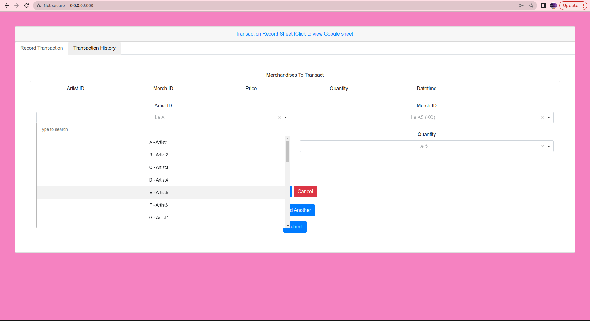
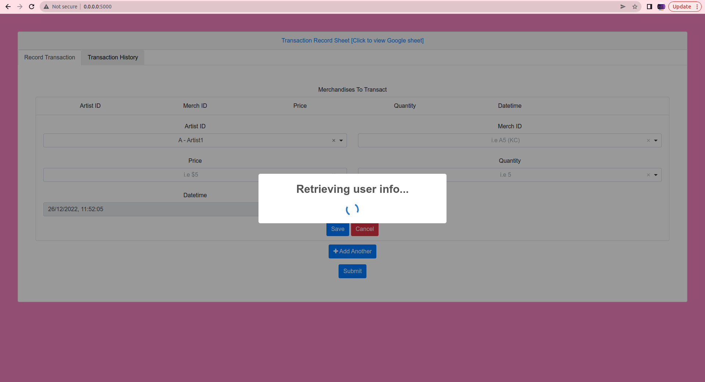
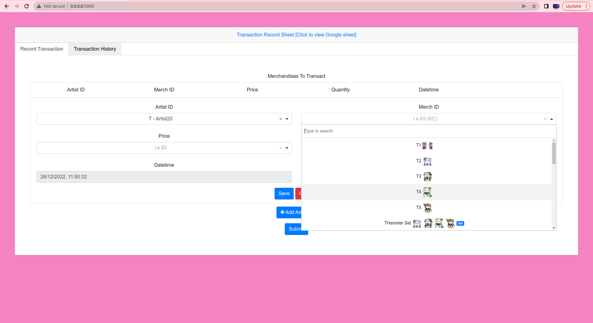
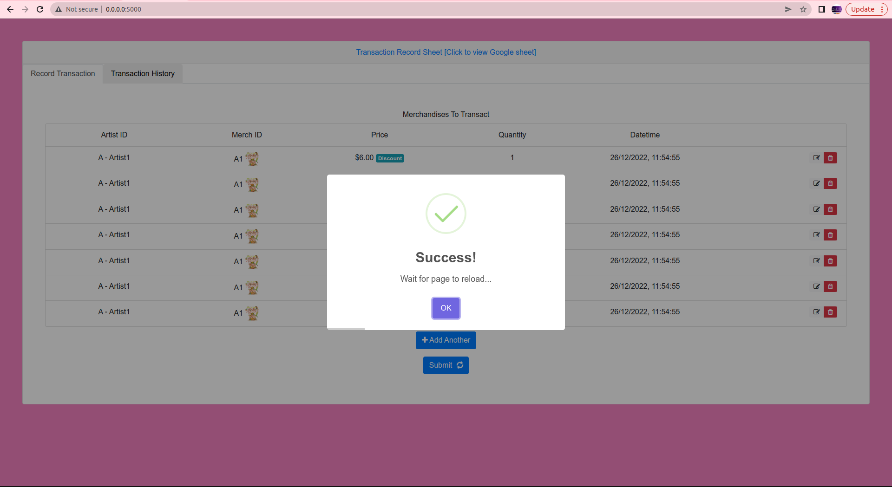
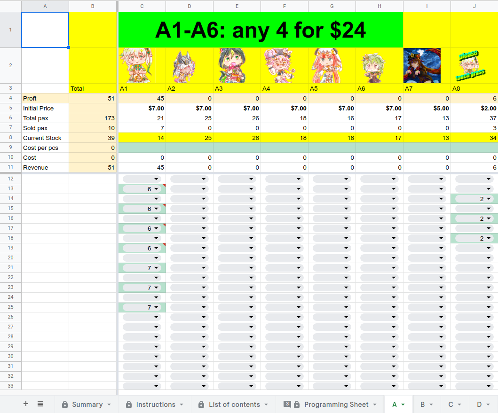
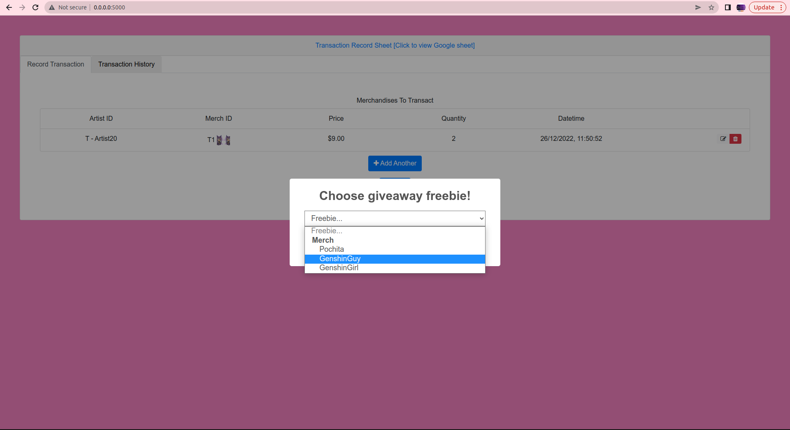
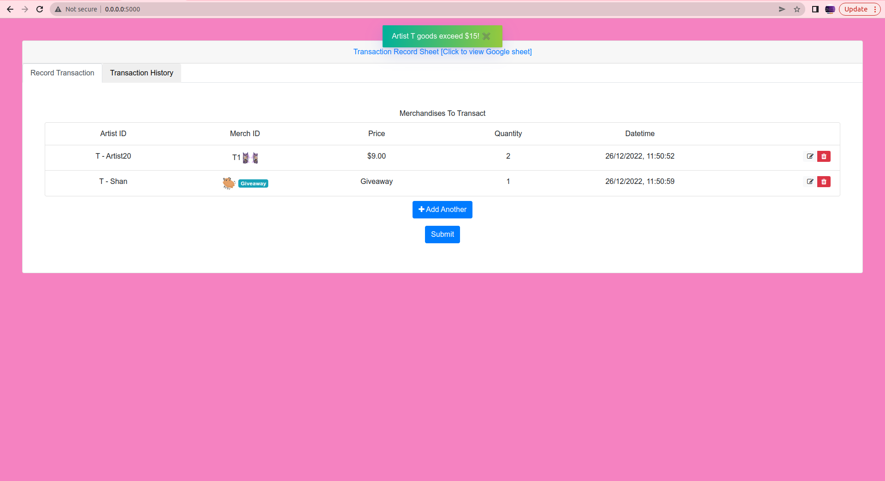
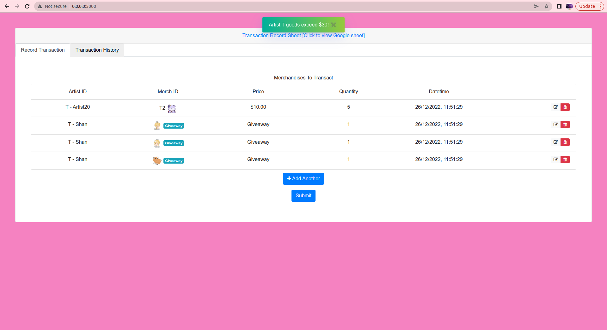
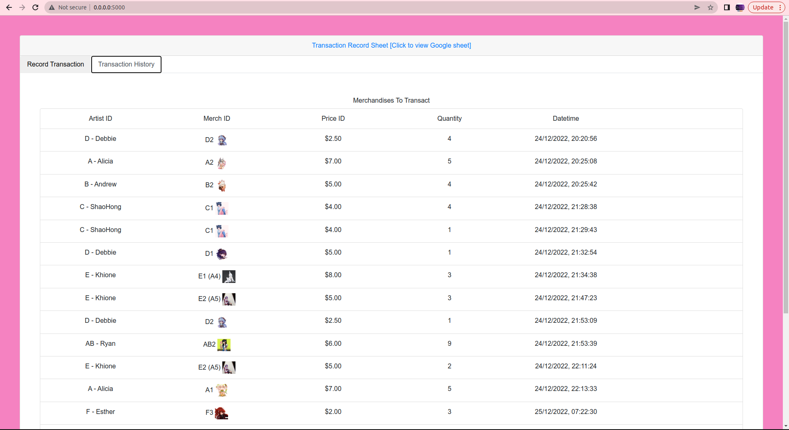

# EOY Transaction app

## Disclaimer
This web app is running off a sanitised google sheet.

## Deployed application
[Click here to see the deployed app!](http://54.250.63.85:5000)

## Premise 
1. There is a use case for a web app when my university's club sets out to booth at a Japanese Cultural event (EOY 2022), and there is a need to account for the transactions and dealings of merchandises by 28 artists, all of which may have very different discount models and pricing. 
1. This application seeks to reflect the information expressed in the google sheet to facilitate such transactions in an idiot proof manner. If not possible to do so for certain business constraints, the application will implement the constraint programmatically (although it is not my preferred way of doing so.)

## Instructions
1. Use Python 3.10
1. Start a virtual environment
1. Install dependencies in requirement.txt
1. run `python app.py`

## Feature List
### Artist Ids 
Application can retrieve list of Artist Ids. When a value is chosen, the application loads the relevant worksheet to update the artist details. Note that each artist Id selected incurs loading time.
- 
- 

### List of Merch IDs
Application can retrieve list of merch ids, eligible prices and quantities to record the transaction. This is generated from information in the Google sheet.
- For ease of use, each merch ID choice is accompanied by the merch image and badge (Set, giveaway, etc.)
- 

### By-batch submission
- Each entry can be saved to be added to the submission batch.
- When done, press submit to submit the batch of submissions to the backend.
- 
- 

### Google sheet synchronicity
- The application loads google sheet data into the form. Therefore, the choices available are updated and applicable.
- The application edits the Google sheet meaningfully with submission order on each submission.
- 

### Discount actuation
- You can examine this feature with Artist1 (A) and Artist20 (T).
- Artist1: Buy 4 of any one merch of A1, A2, A3, A4 or A5 to enjoy $1 discount of each of them.
- Artist20: Purchase above $15 to choose a giveaway sticker; Purchase above $30 to get all 3 giveaway stickers.
- 
- 
- 

### Logging
- Each transaction is logged into the Transaction History that is viewable under its own tab.
- 

### Future
- Turn this into a mobile application!
- Accommodate for a variety of discount models that can be represented on Google sheets and executed on the backend (Currently it is not handled on frontend code :l)
- Code cleanup
- Rustify this
- The images were obtained by copying image urls from the web developer console. If only we have a way to programmatically do this part...
